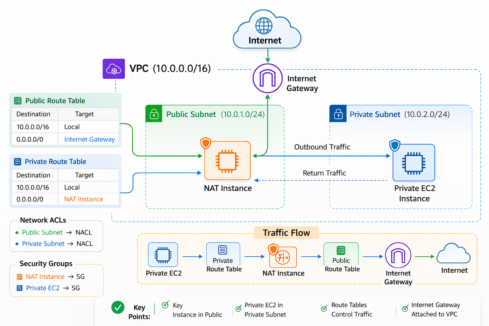

# AWS Networking Lab

AWS networking practice for my transition from **Cloud Support Engineer → DevOps / Cloud Engineer**.

This repository documents my hands-on AWS networking labs including:

* VPC architecture
* Route tables
* NAT configuration
* Security components
* Subnet design

---

# Labs

## Day 1 – VPC Basics

Topics covered:

* VPC creation
* Public and private subnets
* Internet Gateway
* Route tables
* Basic AWS network architecture

### Day 1 Architecture

📂 Folder: `diagrams/`

---

## Day 2 – NAT Instance Architecture

This lab demonstrates how a **private EC2 instance accesses the internet through a NAT Instance located in a public subnet**.

Topics covered:

* NAT instance setup
* Route table configuration
* IP forwarding
* Linux `iptables` NAT
* Private subnet outbound internet access

### Day 2 – Architecture

📂 Folder: [Day 2 NAT Instance](day2-nat-instance)
